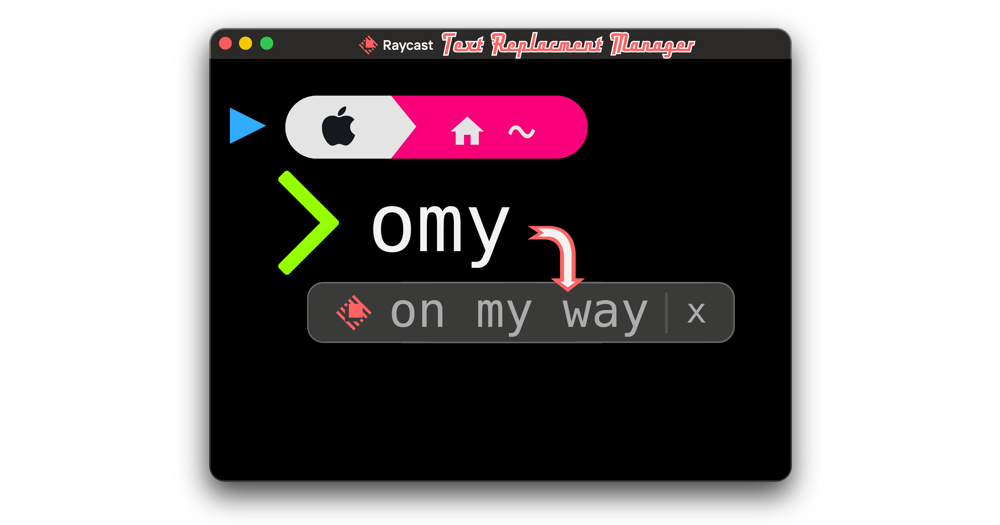

# Text Replacement Manager

Manage macOS Text Replacements from Raycast.

Text Replacement Manager reads your system Text Replacement list, lets you create and update entries, and syncs changes back to macOS. It also keeps Raycast-only metadata for tags and tag colors so larger replacement lists are easier to scan.



## Features

- Browse macOS Text Replacements in Raycast.
- Create, edit, clone, and delete replacements.
- Open a dedicated Create Text Replacement command when you want to add a replacement without opening the full manager.
- Merge tags into an existing replacement when creating the same trigger and replacement text again.
- Search by trigger, replacement text, or tag.
- Validate unique triggers with the macOS-friendly `^\S{1,64}$` pattern.
- Add tags to replacements for search and organization.
- Assign preset, named, RGB, or 3/6-digit hex colors to tags for easier visual identification.
- Import and export replacements as JSON.
- Open macOS Text Replacement settings from Raycast.

## Command

### Manage Text Replacements

View and manage your macOS Text Replacements in one Raycast list. Use the action panel to create replacements, edit existing rows, clone entries, export JSON, import JSON, set tag colors, reload from macOS, or open System Settings. If System Settings is already open, close and reopen it to see newly synced replacements.

### Create Text Replacement

Open a create form directly from Raycast root search. It uses the same validation, tag suggestions, duplicate tag merge behavior, and macOS sync path as the manager command.

## Privacy

The extension reads macOS Text Replacements with local system tools and syncs changes through the local `defaults` command plus `~/Library/KeyboardServices/TextReplacements.db` when that database exists. It refreshes local text input services after syncing so new replacements become available more reliably.

It stores tag metadata and tag colors in Raycast support storage on your Mac. Before writing changes, it creates a local JSON backup of the current macOS replacement rows and a local KeyboardServices database backup when applicable. KeyboardServices backups are capped to the 10 most recent backup sets. No replacement text, tags, or backups are sent to an external service by this extension.

## Development

Install dependencies:

```bash
npm install
```

Run checks:

```bash
npm test
npm run typecheck
npm run lint
npm run build
```

Start the extension in Raycast development mode:

```bash
npm run dev
```

## Support

For issues or feature requests, visit the [GitHub repository](https://github.com/maxludden/Text-Replacement-Manager).

## License

MIT
